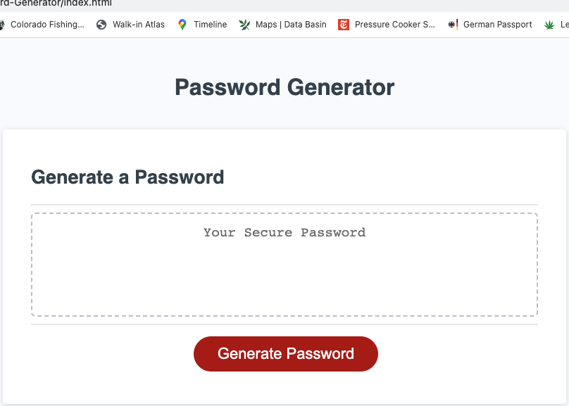
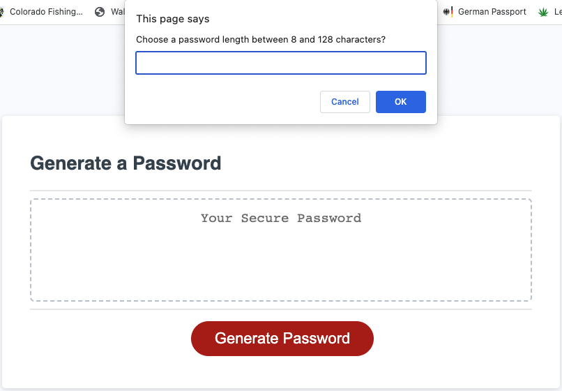
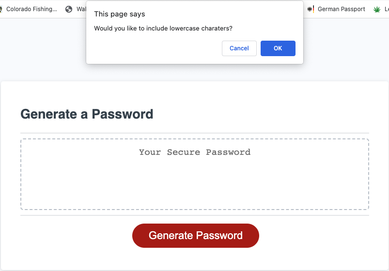
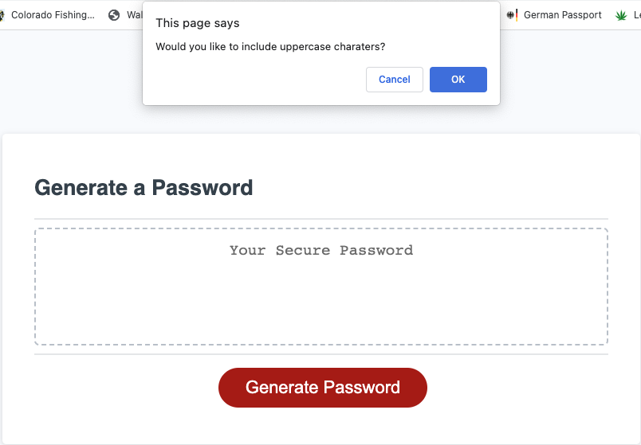
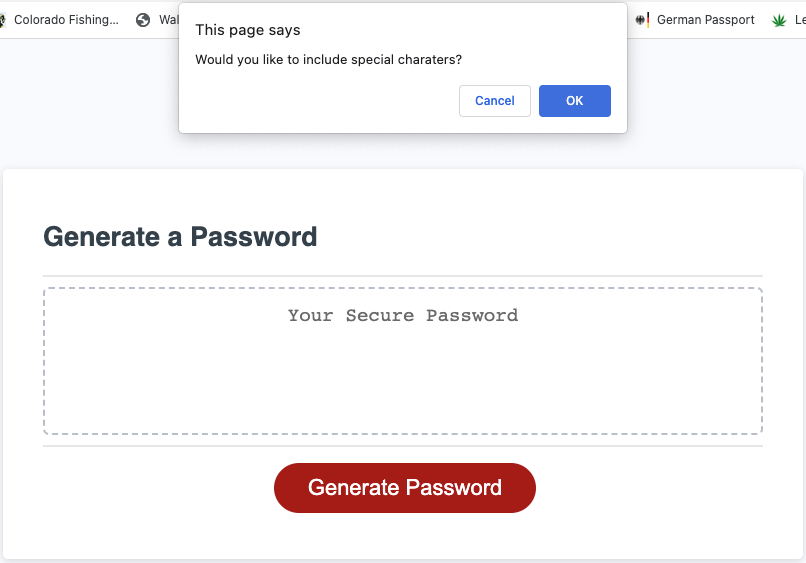
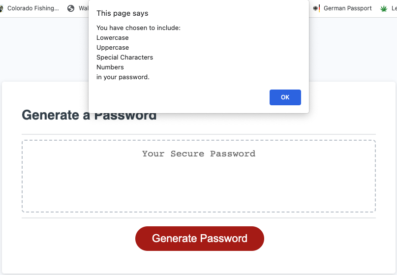
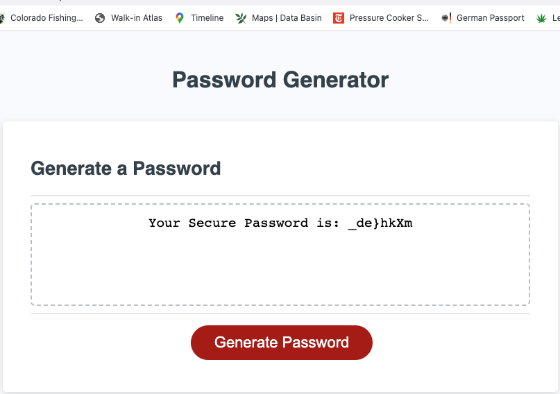

# 03-Password-Generator
For week 03, we were asked to create a random password generator using the provided css and html files, which already contained the necessary formats and stylings for the challenge. This is the reason why I didn't modify neither the style.css and the index.html files.
<br> 
<br> 

## User Story
```
AS AN employee with access to sensitive data
I WANT to randomly generate a password that meets certain criteria
SO THAT I can create a strong password that provides greater security
```
<br>

## Acceptance Criteria
```
GIVEN I need a new, secure password
WHEN I click the button to generate a password
THEN I am presented with a series of prompts for password criteria
WHEN prompted for password criteria
THEN I select which criteria to include in the password
WHEN prompted for the length of the password
THEN I choose a length of at least 8 characters and no more than 128 characters
WHEN asked for character types to include in the password
THEN I confirm whether or not to include lowercase, uppercase, numeric, and/or special characters
WHEN I answer each prompt
THEN my input should be validated and at least one character type should be selected
WHEN all prompts are answered
THEN a password is generated that matches the selected criteria
WHEN the password is generated
THEN the password is written to the page
```
<br>

## Code Information
* Intially, I difined the variables that will eventually form the array of the selected characters by the user to be part of the generated password.
* The function "writePassword()" is started by the "EventListener" at the bottom of the code and starts all the prompts that need to be answer in order for the code to run.
*  Within this function, we define the array that is created by the user's choices and given the length selected by the user, we run a new variable selecting a character in the newly formed array on each iteration of the `for` loop.
* Once the full array is fromed, it's turned into a string and displayed on the site using a 'HTML DOM Element'.
<br>

## 📝 Notes
The following image shows the web application's appearance and functionality:









